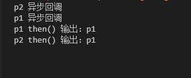

# 探究Promise执行流
Promise 对象用于表示一个异步操作的最终状态（完成或失败），以及其返回的值。
## Promise对象
Promise对象像一个容器，它能包含一个异步操作。在异步操作完成后能将异步回调函数的结果交给接收异步结果的流程。
```js
var p1 = new Promise((resolve, reject) => {
    setTimeout(() => {
        resolve("succeed");
    }, 200);
});

p1.then((v) => {
    console.log(v);
},(err) => {
    console.log(err);
});
```
上面的p1对象就是通过`Promise()`构造函数实例化的一个Promise对象。`Promise()`构造函数接受一个函数作为参数。该函数就包含异步操作。该函数的resolve和reject参数就能用来告诉`then()`方法该Promise是成功还是失败了。异步操作成功就调用resolve，失败就调用reject。成功就执行`then()`的第一个参数（函数），失败就执行第二个参数函数（函数）。rosolve和reject的参数都会分别传给`then()`的两个参数。

上面的例子之调用了`resolve()`没有其他情况，所以一定只会输出`succeed`。
```js
let isSucceed = false;
var p1 = new Promise((resolve, reject) => {
    setTimeout(() => {
        isSucceed? resolve("succeed"): reject(new Error("failed"));
    }, 200);
});

p1.then((v) => {
    console.log(v);
},(err) => {
    console.log(err);
});
```
上面例子就能根据Promise是否成功做出不同处理。
## resolve另一个Promise
当一个Promise对象resolve一个普通值时（string、number、object等）。`then()`的成功处理函数就会收到这个值作为参数。但是当Promise对象resolve另一个Promise对象时，第一个Promise的`then()`的成功处理函数（then的第一个参数）收到的参数并不是第二个的Promise对象，而是第二个Promise对象内部resolve的值。
```js
var p1 = new Promise((resolve, reject) => {
    setTimeout(() => {
        resolve("p1");
    }, 3000);
});

var p2 = new Promise((resolve, reject) => {
    setTimeout(() => {
        resolve(p1);//resolve另一个Promise
    }, 1000);
});

p2.then((v) => {
    console.log(v)
})
```
上面例子就只会在控制台输出一次`p1`。就像是`p2.then()`的第一个参数函数接收的参数是p1内部resolve的值。
> 这时p1的状态就会传递给p2，也就是说，p1的状态决定了p2的状态。如果p1的状态是pending，那么p2的回调函数就会等待p1的状态改变；如果p1的状态已经是resolved或者rejected，那么p2的回调函数将会立刻执行。p2的状态在 1 秒之后改变，resolve方法返回的是p1。由于p2返回的是另一个 Promise，导致p2自己的状态无效了，由p1的状态决定p2的状态。所以，后面的then语句都变成针对后者（p1）。 ————《ES6标准入门》

在上面例子中加一些log。
```js
var p1 = new Promise((resolve, reject) => {
    setTimeout(() => {
        console.log("p1 异步回调");
        resolve("p1");
    }, 3000);
});

var p2 = new Promise((resolve, reject) => {
    setTimeout(() => {
        console.log("p2 异步回调");
        resolve(p1);
    }, 1000);
});

p2.then((v) => {
    console.log("p2 then() 输出：" + v);
})

p1.then((v) => {
    console.log("p1 then() 输出：" + v);
})
```


在执行1秒后会首先输出`"p2 异步回调"`,3秒后剩下三条日志同时输出。当p2的异步完成调用回调函数时resolve了另一个promise对象。所以当前p2的状态被p1状态覆盖。1秒到3秒这个区间p1状态时pending，所以p2状态也是pending。直到p1异步完成（reject或resolve）。`p2.then()`的回调函数才会执行。并且`p2.then()`回调函数参数来自p1内部的resolve或reject。从上面看到p1和p2的then方法都接收到了p1的结果。但p1的执行次数只有一次。

外层Promise接收内层Promise的reject结果。
```js
var p1 = new Promise((resolve, reject) => {
    setTimeout(() => {
        reject(new Error("emm"));
    }, 3000);
});

var p2 = new Promise((resolve, reject) => {
    setTimeout(() => {
        resolve(p1);
    }, 1000);
});

p2.then((v) => {
    console.log("p2 then() 输出：" + v);
},err=>{
    console.log(err)
})

//Error: emm
```


## 使用catch


//promise嵌套状态覆盖，使得成功回调函数返回一个promise可行
//then返回一个promise，等不等于原来promise？
//步骤拆分理解
//then的第一个回调函数返回值