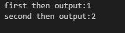
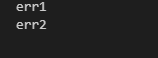
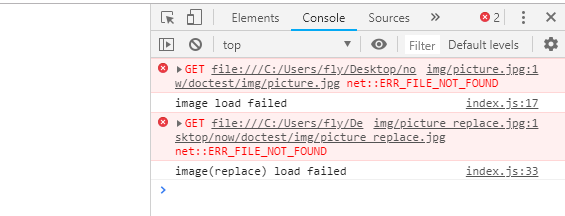

# 探究Promise执行流
Promise 对象用于表示一个异步操作的最终状态（完成或失败），以及其返回的值。
## Promise对象
Promise对象像一个容器，它能包含一个异步操作。在异步操作完成后能将异步回调函数的结果交给接收异步结果的流程。
```js
var p1 = new Promise((resolve, reject) => {
    setTimeout(() => {
        resolve("succeed");
    }, 200);
});

p1.then((v) => {
    console.log(v);
},(err) => {
    console.log(err);
});
```
上面的p1对象就是通过`Promise()`构造函数实例化的一个Promise对象。`Promise()`构造函数接受一个函数作为参数。该函数就包含异步操作。该函数的resolve和reject参数就能用来告诉`then()`方法该Promise是成功还是失败了。异步操作成功就调用resolve，失败就调用reject。成功就执行`then()`的第一个回调函数，失败就执行第二个回调函数。rosolve和reject的参数都会分别传给`then()`的两个回调函数。

上面的例子之调用了`resolve()`没有其他情况，所以一定只会输出`succeed`。
```js
let isSucceed = false;
var p1 = new Promise((resolve, reject) => {
    setTimeout(() => {
        isSucceed? resolve("succeed"): reject(new Error("failed"));
    }, 200);
});

p1.then((v) => {
    console.log(v);
},(err) => {
    console.log(err);
});
```
上面例子就能根据Promise是否成功做出不同处理。
## resolve另一个Promise
当一个Promise对象resolve一个普通值时（string、number、object等）。`then()`的第一个回调函数就会收到这个值作为参数。但是当Promise对象resolve另一个Promise对象时，前者Promise的`then()`的第一个回调函数收到的参数并不是被resolve的Promise对象，而是被resolve的Promise对象内部resolve的值。
```js
var p1 = new Promise((resolve, reject) => {
    setTimeout(() => {
        resolve("p1");
    }, 3000);
});

var p2 = new Promise((resolve, reject) => {
    setTimeout(() => {
        resolve(p1);//resolve另一个Promise
    }, 1000);
});

p2.then((v) => {
    console.log(v)
})
```
上面例子就只会在控制台输出一次`p1`。就像是`p2.then()`的第一个参数函数接收的参数是p1内部resolve的值。
> 这时p1的状态就会传递给p2，也就是说，p1的状态决定了p2的状态。如果p1的状态是pending，那么p2的回调函数就会等待p1的状态改变；如果p1的状态已经是resolved或者rejected，那么p2的回调函数将会立刻执行。p2的状态在 1 秒之后改变，resolve方法返回的是p1。由于p2返回的是另一个 Promise，导致p2自己的状态无效了，由p1的状态决定p2的状态。所以，后面的then语句都变成针对后者（p1）。 ————《ES6标准入门》

在上面例子中加一些log。
```js
var p1 = new Promise((resolve, reject) => {
    setTimeout(() => {
        console.log("p1 异步回调");
        resolve("p1");
    }, 3000);
});

var p2 = new Promise((resolve, reject) => {
    setTimeout(() => {
        console.log("p2 异步回调");
        resolve(p1);
    }, 1000);
});

p2.then((v) => {
    console.log("p2 then() 输出：" + v);
})

p1.then((v) => {
    console.log("p1 then() 输出：" + v);
})
```


在执行1秒后会首先输出`"p2 异步回调"`,3秒后剩下三条日志同时输出。当p2的异步完成调用回调函数时resolve了另一个promise对象。所以当前p2的状态被p1状态覆盖。1秒到3秒这个区间p1状态时pending，所以p2状态也是pending。直到p1异步完成（reject或resolve）。`p2.then()`的回调函数才会执行。并且`p2.then()`回调函数参数来自p1内部的resolve或reject。从上面看到p1和p2的then方法都接收到了p1的结果。但p1的执行次数只有一次。

外层Promise接收内层Promise的reject结果情况。
```js
var p1 = new Promise((resolve, reject) => {
    setTimeout(() => {
        reject(new Error("emm"));
    }, 3000);
});

var p2 = new Promise((resolve, reject) => {
    setTimeout(() => {
        resolve(p1);
    }, 1000);
});

p2.then((v) => {
    console.log("p2 then() 输出：" + v);
},err=>{
    console.log(err);//会执行这一行，输出Error: emm
})
```
## then()的返回值
then的返回值也是一个Promise对象（注意，这里反回的Promise对象是一个新的Promise对象）。
```js
var p = new Promise((resolve, reject) => {
    setTimeout(() => {
        resolve(1);
    }, 1000);
});
console.log(p.then());//Promise { pending }
```
那么这个新的Promise是如何reolve和reject的呢。`then()`的逻辑大概可以看成这样。
```js
Promise.prototype.then (resolveHandle, rejectHandle) {
    if(promise 成功){
        return new Promise(resolve => resolve(resolveHandle()));
    }else{
        return new Promise(resolve => resolve(rejectHandle()));
    }
}
```
当之前的Promise成功时`then()`就会执行`resolveHandle()`，并返回一个新Promise对象。新的Promise对象会resolve`resolveHandle()`的执行结果。then返回的新promise对象只会resolve而没有reject操作。如果`resolveHandle()`或`rejectHandle()`没有返回值（即返回undefined）。新的Promise对象就会resolve一个undefined。
```js
var p = new Promise((resolve, reject) => {
    setTimeout(() => {
        resolve(1);
    }, 1000);
});

var newp = p.then(v => { 
    console.log("first then output:" + v);
    return v + 1;
});//返回了一个新的promise

//console.log(newp);
//会输出Promise { pending }

newp.then(v => {
    console.log("second then output:" + v);
});

//或者这样简写
/*
p.then(v => {
    console.log("first then output:" + v);
    return v + 1;
}).then(v => {
    console.log("second then output:" + v);
});
*/
```


reject返回时的情况。
```js
var p = new Promise((resolve, reject) => {
    setTimeout(() => {
        reject(1);
    }, 1000);
});
p.then(v => {
    console.log("first then output:" + v);
    return v + 2;
},v => {
    console.log("first then output:" + v);
    return v + 1;//新Promise将会resolve这个返回值
}).then(v => {
    console.log("second then output:" + v);
});
```


`then()`的两个回调函数可以返回一个普通值，也可以返回一个Promise对象。如果`then()`回调函数返回了一个Promise对象，那么结果就是`then()`返回了一个新Promise对象，这个新Promise对象又resolve了一个`then()`回调函数返回的Promise对象。
```js
var p = new Promise((resolve, reject) => {
    setTimeout(() => {
        resolve("p resolve");
    }, 200);
});

p.then(v => {
    console.log(v)
    var p2 = new Promise((resolve, reject) => {
        setTimeout(() => {
            resolve("p2 resolve");
        }, 200);
    });
    return p2;//返回一个新promise
}).then(v => {
    console.log(v);
})
```


这里第一个then方法`p.then()`返回了这样一个Promise对象。
```js
new Promise(resolve => resolve(p2));
```
前面说过被resolve的Promise对象状态会覆盖外层Promise对象。所以第二个`then()`回调函数接受的值将是这个内层Promise对象resolve或reject的值。

内层Promise对象reject时。
```js
var p = new Promise((resolve, reject) => {
    setTimeout(() => {
        resolve("p resolve");
    }, 200);
});

p.then(v => {
    console.log(v)
    var p2 = new Promise((resolve, reject) => {
        setTimeout(() => {
            reject("p2 resolve");//reject
        }, 200);
    });
    return p2;
}).then(null, v => {//第二个回调函数执行
    console.log(v);
})
//和上面例子输出同样的内容
```
## then的使用
`then()`的第二个回调函数在promise对象内部reject时会执行。当promise对象内部出现错误时promise状态也会变成rejected，并reject这个error。
```js
var p = new Promise((resolve, reject) => {
    reject(new Error("err1"));
});
p.then(null,err => {
    console.log(err);//err1
})

var p2 = new Promise((resolve, reject) => {
    throw new Error("err2");//err2
});
p2.then(null,err => {
    console.log(err);
})
```
上面两个promise对象是一样的效果。

`then()`如果没有设置第二个回调函数，那么它就会把reject向后传递。
```js
var p = new Promise((resolve, reject) => {
    reject(new Error("err1"));
    //或者
    //throw new Error("err1");
});

p.then(v => {
    console.log(v);
}).then(null, err => {
    console.log(err);//会执行这一步
})
```
`then()`回调函数中的错误也会交给后面的`then()`处理。
```js
var p = new Promise((resolve, reject) => {
    resolve("123");
});
p.then(v => {
    console.log(123);
    throw new Error("emm...");
}).then(null,err => {
    console.log(err);
})
```


无论有多少个then，只要都没有第二个回调函数那么reject和回调函数中的Error都会向后传递。
```js
var p = new Promise((resolve, reject) => {
    reject("123");
});
p.then()
.then()
.then(null,err => {
    console.log(err);//会执行这一行
})
```
当前面的某一个then方法设置了第二个回调函数。reject就不会继续向后传递了。但回调函数中的error会继续向后传递。
```js
var p = new Promise((resolve, reject) => {
    reject("err1");
});
p.then()
.then(null, err =>{
    console.log(err);
    throw new Error("err2");//注释掉这行，后面的then就不会有输出
})
.then(null,err => {
    console.log(err);
})
```


`then()`的回调函数返回一个Promise的话。后面的then又能捕获新的Promise的reject和resolve。
```js
var p = new Promise((resolve, reject) => {
    reject("err1");
});
p.then()
.then(null, err =>{
    console.log(err);
    return new Promise((resolve,reject) => {
        reject("err2");
    })
})
.then(null,err => {
    console.log(err);
})
```


## catch的使用
`catch(()=>{})`其实就是`then(null,()=>{})`的另一个写法。我们可以把它放在then链式调用最后来捕获各个环节的错误。
```js
var isSucceed = true;
var p1 = new Promise((resolve, reject) => {
    setTimeout(() => {
        if(isSucceed){
            let res = {data: 123};
            resolve(res);
        }else{
            let err = new Error("err from p1");
            reject(err);
        }
    }, 200);
});

p1.then(res => {
    console.log(res.data);
    //do something with res.data
    let emm = res.data.emm.emm;//error
}).catch(err => {
    console.log(err.message);
})
```
当`isSucceed`为true时会执行第一个then的回调，在这个回调里故意做了错误处理。这个错误会被`catch()`捕捉到。输出结果如下：


当`isSucceed`为false时会reject一个错误。由于第一个`then()`没有设置第二个回调函数。这个reject会被向后传递。直到遇到有处理回调函数的部分（`catch()`或`then(null,()=>{})`）。输出结果如下：


## 使用promise封装一个图片加载的例子
这里实现一个需求，使用promise加载一个图片，当图片加载失败时就加载另一个通用的替代图片。
```js
function LoadImg(url, replaceurl){
    let load =  new Promise ((resolve, reject) => {//加载图片
        let img = new Image();
        img.onload = function () {
            resolve(img);
        };
        img.onerror = function () {
            reject(new Error("image load failed"));
        };
        img.src = url;
    });

    return new Promise((resolve, reject) => {//返回一个promise用来向外部传递加载后的图片
        load.then(img => {
            resolve(img);//如果图片加载成功就resolve这个图片
        }).catch(err => {//图片加载失败就加载代替图片
            console.log(err.message);
            let img = new Image();
            img.onload = function () {
                resolve(img);//代替图片加载成功就resolve这个代替图片
            };
            img.onerror = function () {
                reject(new Error("image(replace) load failed"));//代替图片也加载失败
            };
            img.src = replaceurl;
        })
    })
}
LoadImg("img/picture.png","img/picture_replace.png").then(img => {
    console.log(img);//这里的img并不知道是正常图片还是代替图片
    document.querySelector("body").appendChild(img);
}).catch(err => {
    console.log(err.message);
})
```
当一切正常会出现以下结果：


当修改正常图片的url后缀为jpg时就找不到该图片，就会加载代替图片：


当两个图片都无法加载时：



## 相关链接
* [返回目录](/README.md)


