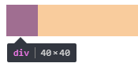

# css常用单位和字体大小

css有绝对单位和相对单位。绝对单位有英寸、厘米、毫米、磅等。

|  单位 | 符号 | 说明 | 
| :- | -: | :- | 
| 英寸 | in | 1in = 2.54cm | 
| 厘米 | cm | 1cm = 0.01m | 
| 毫米 | mm | 1mm = 0.1cm |
| 磅 | pt | 1pt = 1/72in |

再实际使用中绝对单位使用很少。我们一般使用相对单位。

常用相对单位：

| 单位 | 说明 |
| :- | :- |
| px | 屏幕一个像素点的宽度（由屏幕物理尺寸和分辨率决定） |
| em | em表示当前元素font-size的大小 |
| rem | css3的新单位，rem和em一样都表示font-size大小，不过rem单位相对于html元素的字体大小 |
| % | 一般是父元素相同属性的百分比 |
| ex | 表示字体小写字母的高度（实际中一般是1ex = 0.5em） |

## px和em配合控制段落
当我们给p标签设置好字体大小（font-size）后就能使用em来格式化段落。
```css
p {
    font-size: 24px;    /*字体大小*/
    text-indent: 2em;   /*段落缩进为两个字*/
    line-height: 1.5em; /*每一行高度为1.5个字*/
}
```
em表示当前标签文本一个字的大小，上面1em等于p标签的`font-size`属性值。如果p标签没有设置`font-size`属性，那么`font-size`就会从父级继承。如果所有父级都没有`font-size`属性那就会使用html标签的字体大小（浏览器默认16px），所以如果没有任何标签设置`font-size`时1em就等于html标签的摩默认字体大小16px。

当元素嵌套了多层的时候中间某一个元素设置了`font-size`属性后，子标签继承了它`font-size`属性。那么后面子元素的em就可能与前面不相等了。
```html
<div style="font-size:20px">
    <p style="font-size:1em;">
        我的字体是20px
    </p>
    <div style="font-size:28px">
        <p style="font-size:1em">
            我的字体是28px
        </p>
    </div>
</div>
```


更需要注意的是如果连`font-size`属性都是使用的em单位，会造成子元素的尺寸很难预测。因为元素会先继承父级的`font-size`此时当前元素的em就是继承过来的`font-size`的值，再通过`font-size:*em`这样的方式设置字体大小的话就看上去像直接继承了父级字体大小的*倍。
```html
<div style="font-size:20px">
    <p style="font-size:1em;">
        我的字体是20px
    </p>
    <div style="font-size:2em"><!--em大小继承自父级（font-size值为40px）-->
        <p style="font-size:1em"><!--em大小继承自父级（font-size值为40px）-->
            我的字体是40px
        </p>
    </div>
</div>
```


上面我们看到两个p标签虽然都是`font-size:1em`但尺寸是不一样。这样在使用em相对单位时就需要些计算，当层级较多时就比较麻烦，所以使用em单位时要谨慎。不过css3中有了rem单位，使用起来更加简单明了。
> 和尽量使用相对尺寸单位一样，为了字体大小的可维护性和伸缩性，W3C更推荐使用em作为字体尺寸单位。需要注意的是，如果存在3层以及3层以上的字体相对尺寸的设置，则对于实际字体大小的计算，就会变得相对麻烦。这个时候，在满足浏览器兼容性的情况下，可以考虑使用CSS3的新特性rem：根据固定根元素的字体大小来设置相对尺寸大小，这也是近几年移动APP所兴起的使用方式。

## rem和px响应式开发
em是当前元素字体大小，当前元素没设置字体大小就从父级继承字体大小。当元素嵌套了多层的时候中间某一个元素设置了`font-size`属性后，子标签继承了它`font-size`属性。那么前后的em就可能不相等了。如果使用css3的rem单位就很简明了，因为rem始终是以html标签为参考的。1rem始终等于html标签设置的字体大小。
```html
<html lang="en" style="font-size:40px">
<body style="font-size:10px">
    <div style="width:1rem;height:1rem;background:red;"></div>
</body>
</html>
```


上面代码div尺寸单位使用的是rem。虽然我们在div的直接父级元素body标签设置了`font-size:10px`，但是rem单位是以根标签html为参照的，所以div的长宽都会是40px。修改html标签字体大小后所有使用rem的地方都会改变。以此可以设计响应不同分辨率屏幕的网页。
```html
<!DOCTYPE html>
<html lang="en">
<head>
    <style>
        html{font-size:12px}
        @media screen and (min-width:320px) and (max-width:374px){html{font-size:14px}}
        @media screen and (min-width:375px) and (max-width:414px){html{font-size:16px}}
        @media screen and (min-width:415px) and (max-width:639px){html{font-size:18px}}
        @media screen and (min-width:640px) and (max-width:719px){html{font-size:22px}}
        @media screen and (min-width:720px) and (max-width:749px){html{font-size:24.5px}}
        @media screen and (min-width:750px) and (max-width:799px){html{font-size:26.5px}}
        @media screen and (min-width:800px){html{font-size:25px}}
    </style>
</head>
<body>
    <div style="width:1rem;height:1rem;background:red;"></div>
</body>
</html>
```
上面我们使用了媒体查询，在不同分辨率范围下设置了html标签的`font-size`，当分辨率越大时字体就越大。div又是使用的rem单位。所以在越大的分辨率下，div就有越大的尺寸。
## css3中的新单位
css3中新单位：

| 单位 | 说明 |
| :- | :- |
| rem | rem和em一样都表示font-size大小，不过rem单位相对于html元素的字体大小 |
| vw | viewpoint width，视窗宽度，1vw等于视窗宽度的1% |
| vh | viewpoint height，视窗高度，1vh等于视窗高度的1% |
| vmin | vw和vh中较小的那个 |
| vmax | vw和vh中较大的那个 |

css3中新增的单位提供了可以获取视口尺寸的方法，这样让我们设计页面更加灵活。在这些单位出现前有的效果可能要使用js才能完成。

使用vw单位画一个随着浏览器视窗宽度变化而变化的正方形。
```html
    <div style="width:20vw;height:20vw;background:red;"></div>
```
这样我们就画了一个随着视窗宽度变化而变化的正方形，如果没有vw这个单位我们就可能要用js实时获取div的宽度，再把获取到的值设置到div的高度。

## 总结 
em单位标准定义是当前元素的文本字体大小，当前元素的字体大小可以是自己style中写明的，也可以是从父级元素继承的。rem是直接相对于html标签的字体大小，与中间的元素字体大小无关。 建议使用rem来作为页面整体的尺寸标准。使用em单位当层级较多时就比较麻烦，不过em单位用来给当前元素文本设置缩进、行距等格式非常方便（1em就表示当前元素一个字体宽度）。
## 相关链接
* [返回目录](/README.md)