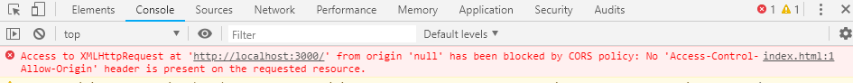
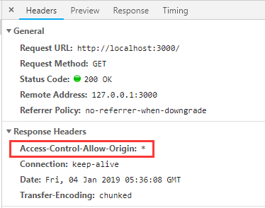
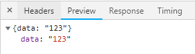

# JSONP原理
## 跨域限制
浏览器的同源策略限制了不同域名下的资源访问。比如 www.aaa.com 域名下的js文件在浏览器执行是不能用ajax请求 www.bbb.com下的资源。

先用node写一个简单的http服务，命名为server.js。
```js
//server.js
let http = require("http");
let server = http.createServer((req,res)=>{
    res.write(JSON.stringify({data:"123"}));
    res.end();
})
server.listen(3000);
```
`node server.js`启动服务。浏览器中访问localhost:3000会直接返回如下结果：


接下来在磁盘的任意位置创建一个html文件。在html的script写入一个http请求。
```html
<script>
    var xmlreq = new XMLHttpRequest();
    xmlreq.open("GET","http://localhost:3000");
    xmlreq.send();
</script>
```
在浏览器直接打开这个html文件，是以`file://`的方式打开的，而这里的请求是`http://`的方式。只要域名不同，端口不同，协议不同都算跨域。所以浏览器控制台会有如下输出。



根据报错的提示修改以下server.js。设置http的请求响应头。
```js
let http = require("http");
let server = http.createServer((req,res)=>{
    res.setHeader('Access-Control-Allow-Origin','*');//增加这一行
    res.write(JSON.stringify({data:"123"}));
    res.end();
})
server.listen(3000);
```
上面增加的第三行设置了响应头的`Access-Control-Allow-Origin`为`*`。`*`号表示在浏览器跨域时允许所有域名访问。也可以设置成只允许指定的域名访问。把域名替换掉`*`。重启服务，刷新浏览器就能看到报错消失。在控制台network分页就能看到后台设置的响应头和返回的数据。




## jsonp原理
如果不用设置`Access-Control-Allow-Origin`header的方法也可以用jsonp的方法。jsonp的实现有以下几点：

* jsonp是利用html的script标签不受浏览器同源策略限制的特性来实现跨域的。
* srcipt标签的src属性可以是完整的url。比如用script标签引入Jquery就可以在script的src属性中写http://xxx.com/jquery.min.js。
* script标签会使用get方法请求script标签src属性里的url，将返回的结果作为javascript代码执行。

修改server.js。
```js
//server.js
let http = require("http");
let server = http.createServer((req,res)=>{
    res.write("console.log('hello')");
    res.end();
})
server.listen(3000);
```
删掉html之前的script脚本。新增加下面一行。
```js
  <script src="http://localhost:3000"></script>
```
server.js关闭了允许跨域访问。且只返回了一个字符串`"console.log('hello')"`。由于script不受浏览器同源策略限制尽管没有允许跨域访问的header，script标签依然仍请求到 http://localhost:3000 返回的字符串，并且浏览器会把会把这段字符串当作脚执行。本只要返回的字符串是规范的js脚本，就能正常执行。所以浏览器控制台会输出“hello”。

如果后台返回一个这样的字符串`"callback()"`，那么浏览器就会执行这一句代码。只要浏览器js的上下文定义了名为callback的函数，请求到的js脚本就能正常执行。所以在请求前可以定义好一个叫callback函数，在script请求时带上这个函数名。后台用传过来的函数名拼接一个复合js函数执行语句的字符串，再返回给前端，前端就能执行之前定义好的那个叫callback的函数了。后台在拼接字符串时可以把数据加载函数的参数位置。比如`"callback + "(" + 123"+ ")"`。这样就拼接了一个带123实参的函数执行语句。

修改html如下。
```html
<!DOCTYPE html>
<html lang="en">
<head>
    <meta charset="UTF-8">
</head>
<body>
  <script>
    function callback(res) {  //定义了一个回调函数
        console.log(res.data);
    }
  </script>
  <script src="http://localhost:3000?func=callback">
    //把回调函数名通过查询字符串传给后台
  </script>
</body>
</html>
```
修改server.js如下：
```js
//server.js
let http = require("http");
let querystring = require("querystring");
let parseurl = require("url").parse;
let server = http.createServer((req,res)=>{
    var qstr = parseurl(req.url).query; 
    var query = querystring.parse(qstr);
    //以上是解析查询字符串，以便获取回调函数名

    var resData = JSON.stringify({data:1234567890});//将要传输的数据转换成字符串

    res.write(query.func + "(" + resData + ")");//拼接函数名和数据为一个js函数调用语句，并返回给前端
    res.end();
})
server.listen(3000);
```
在第二个script标签加载完成时就会调用第一个标签定义的函数，浏览器控制台会输出后台返回的数据`1234567890`。

直接在html里写用来的请求的script标签会在页面加载时就请求，这样并不能满足所有情况。如果在需要请求时用js创建标签再添加到页面就能再需要的时候请求。
```js
<!DOCTYPE html>
<html lang="en">
<head>
    <meta charset="UTF-8">
</head>
<body>
  <script>
    function callback(res) {
        console.log(res.data);
    }
    var newscript = document.createElement("script");
    newscript.src = "http://localhost:3000?func=callback";
    setTimeout(() => {
      document.querySelector("body").appendChild(newscript);
    }, 2000);
  </script>
</body>
</html>
```
## 总结
jsonp原理最重要的两点。一是浏览器对script标签没有同源限制，二是script的src请求到的内容会被当做javascript脚本执行。
## 没有同源限制的标签
* script的src
* form的actions
* a、img等
## 相关链接
* [返回目录](/README.md)

