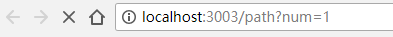
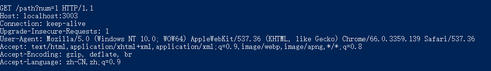
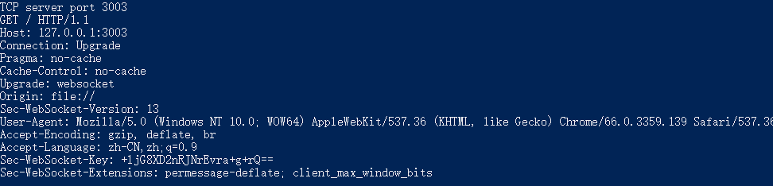
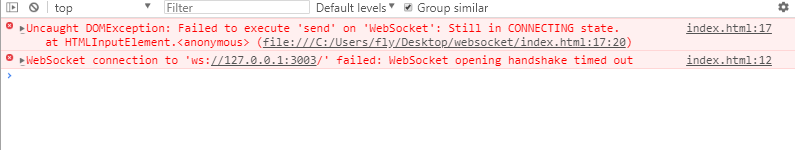
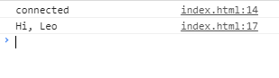

# TCP、HTTP和WebSocket
这里是一些自己的探索和总结，顺便记录一下。主要是了解一下TCP、HTTP和WebSocket三者关系和异同。

WebSocket和HTTP一样都是基于TCP的网络协议，WebSocket是HTML5开始提供的一种通讯的协议，HTTP和WebSocket是有区别的，有各自己适用的场景。

## TCP
TCP是一种面向连接的、可靠的、基于字节流的传输层通信协议。简单地说建立了TCP连接后计算机之间就能持续地互相通信。实际应用中无论是服务器还是客户端都能够互相主动发送消息，如服务器给客户端推送消息，聊天室功能等。与TCP相对地就是UDP协议，UDP则不是长连接的协议。

我们新建一个TCTserver.js，使用node来创建我们的TCP服务器。
```javascript
//TCTserver.js
var net = require("net");
const server = net.createServer();  //创建TCP服务

server.on('connection',(socket)=>{  //新客户端连接时触发，这里socket就是客户端socket对象
    socket.on("data",(data)=>{      //客户端发送有数据时触发
        console.log(data.toString())
    });
})
server.listen(3003,()=>{
    console.log("TCP server port 3003");
});
```
执行命令`node TCTServer.js`我们就建立了一个TCP服务器。接下来我们建立一个连接TCP的客户端来连接这个服务器。新建一个TCPclient.js。
```javascript
//TCPclient.js
var net = require("net");
var client = new net.Socket();

client.connect(3003,"127.0.0.1",()=>{
    client.write("来自客户端的数据");//发送数据
    setTimeout(() => {
        client.write("2秒后的数据");//发送数据
    }, 2000);
});
```
执行命令`node TCPclient.js`(确保已经启动服务)。上面client是个socket对象，可以连接TCP服务，在连接的状态下可以和服务器互相收发消息。启动客户端2秒后，服务端命令行窗口如下。


这里的案例并没有很好的交互，并没有体现TCP的长连接的特性。可以前往我的案例[TCP聊天室](https://github.com/songshuangfei/node-demo/tree/master/chat-room)体验TCP连接。

## HTTP
HTTP是应用层协议，传输层是TCP协议。从前面知道TCP是是持续可靠的连接，HTTP是基于TCP协议的，所以HTTP也是能保持长连接的。在HTTP1.0中默认使用短连接。比如网页中两个img标签，在HTTP短链接下，第一个img标签获取图片资源时底层TCP会连接并传输图片资源，然后TCP连接断开。当第二个img标签获取图片获取图片资源时底层TCP又会重新连接再传输图片文件。如果网页应用资源较多，这样不断重复多次TCP连接就很浪费资源。所以HTTP1.1规定了默认保持长连接，数据传输完成了保持TCP连接不断开，等待在同域名下继续用这个通道传输数据。一段时间后这个HTTP长连接才会断开。是否是HTTP长连接由浏览器决定，浏览器会再TCP响应头发送`Connection:keep-alive`表示保持连接。HTTP长连接保持的时间由服务器决定。nodejs实现的http服务器默认长连接保持时间是2分钟。

我们使用前面的TCPserver.js重新开启这个TCP服务器，看看浏览器发送什么给了TCP服务器。命令`node TCPserver.js`。确保TCP服务启动后我们在浏览器地址栏输入TCP服务端口下的任意一个url路径比如 `http://127.0.0.1:3003/path?num=1`。注意，服务器是一个TCP服务，然而我们在浏览器使用了HTTP访问，发送HTTP连接时浏览器会与服务器先建立TCP连接，所以我们TCP服务也会收到来自浏览器的TCP连接。



chrome浏览器地址栏刷新按钮是处于加载状态。



TCP服务器与浏览器建立了TCP连接，也收到了浏览器发送的数据。第一行信息则是HTTP请求的方法，请求路径和HTTP版本。第二行是请求的主机。第三行就是我们前面说的浏览器告诉服务器要保持HTTP连接着。后面则是一些浏览器信息。可预见的是完整的HTTP服务会在TCP连接时跟据浏览器发送的数据与浏览器构建http连接，返回浏览器请求path下的资源并保持这个http连接。因为我们这里只有一个TCP服务，虽然获取到浏览器发送来的信息，但并没有根据这些信息和浏览器建立http连接。所以浏览器一直处于等待状态。

http是web中用的很多的，node自带http模块能很方便的帮助我们实现一个http服务器。
```javascript
var http = require("http");
var server = http.createServer(function(req,res) {
    res.writeHead(200,{
        "content-type":"text/html"
    })
    res.write(`<h1 style="color:#5cad9e;text-align:center;">welcome to ${req.url}</h1>`);
    res.end();
})
server.listen(3000,function(){
    console.log("port 3000")
})
```
在浏览器中打开`http://localhost:3000/home`结果如下


## WebSocket
WebSocket 使得客户端和服务器之间的数据交换变得更加简单，允许服务端主动向客户端推送数据。在 WebSocket API 中，浏览器和服务器只需要完成一次握手，两者之间就直接可以创建持久性的连接，并进行双向数据传输。

我们在一个html中实现向一个服务器发送websocket请求。新建一个index.html。
```html
<!--index.html-->
<body>
    <input id="send-msg" type="button"  value="send"/>
    <script>
        var socket = new WebSocket("ws://127.0.0.1:3003");//连接websocket服务器
        socket.onopen = function(){ //连接成功时
            console.log("connected")
        }
        socket.onmessage = function(e){//收到服务器发送消息时
            console.log(e.data)
        }
        document.getElementById("send-msg").addEventListener("click",function(){
            socket.send("Leo")
        })
    </script>
</body>
```
上面我们就在网页中实现了一个WebSocket客户端。请求地址中ws协议就是Websocket协议。然而我们并没有WebSocket服务器。我们只有前面的TCP服务器。和测试HTTP请求一样，我们启动这个TCP服务 `node TCPserver.js`，再在浏览器中打开这个index.html看看会发生什么。



和HTTP一样WebSocket也会先与服务器建立TCP连接，这个TCP服务器也会收到来自浏览器的信息。所以现在只是建立起了TCP连接。我们尝试点击页面中发送数据的按钮。



当我们点击了send按钮向服务器发送数据后会立即出现上图的第一个错误，它告诉我们websocket任然处于连接中的状态，这是因为我们的服务器只有一个TCP服务，TCP连接后浏览器会处于等待连接WebSocket的状态，所以无法发送数据。直到连接超时后会出现第二个错误，他告诉我们websocke连接“握手”超时。这里我们需要知道websocket有几个连接状态。
```javascript
var socket = new WebSocket("ws://127.0.0.1:3003");
console.log(socket.readyState)//获取状态
```
在一个正常的WebSocket连接时，发送信息前最好判断一下WebSocket的链接状态。`Socket.readyState`值有4种情况。
* 0 - 表示连接尚未建立。
* 1 - 表示连接已建立，可以进行通信。
* 2 - 表示连接正在进行关闭。
* 3 - 表示连接已经关闭或者连接不能打开。

那么我们能不能在nodejs中引入http模块一样引入WebSocket模块来建立一个完整的WebSocket服务呢。遗憾的是nodejs标准模块中并不存在能建立WebSocket服务的模块。但是我们能使用npm安装可以构建WebSocket服务的模块“ws”。
```
npm install --save ws
```
安装好依赖后我们新建一个websocket.js。
```javascript
const WebSocket = require('ws');
const WebSocketServer = WebSocket.Server;
const ws = new WebSocketServer({
    port: 3003
});
ws.on('connection', function (ws) {//有连接时触发
    console.log(`someone connected`);
    ws.on('message', function (message) {//客户端发送消息时触发
        console.log(`name: ${message}`);
        ws.send(`Hi, ${message}`, (err) => {//向客户端发送消息
            if (err) {
                console.log(err);
            }
        });
    })
});
```
我们启动这个WebSocket服务器`node websocket.js`。再重新打开我们的index.html。WecSocket命令行窗口会输出`someone connected`，浏览器控制台也输出了`connected`。证明链接成功。我们再点击页面的send按钮，浏览器会发送一个字符串`"Leo"`表示名字，服务器收到消息后会再命令行窗口输出`name: Leo`，再给客户端发送一个字符串`"Hi,Leo"`。再看浏览器控制台，WebSocket客户端已经将这个字符串输出到了控制台。

服务端命令行窗口:


浏览器控制台:



## 总结
HTTP和WebSocket都是基于TCP的，所以HTTP和WebSocket连接建立时底层都会先进行TCP连接。HTTP连接能保持一段时间不关闭并在未关闭的通道中传输网络资源。WebSocket则能一直保持连接直到一方主动断开连接，可用于消息推送等功能。

## 相关链接
* [返回目录](/README.md)


